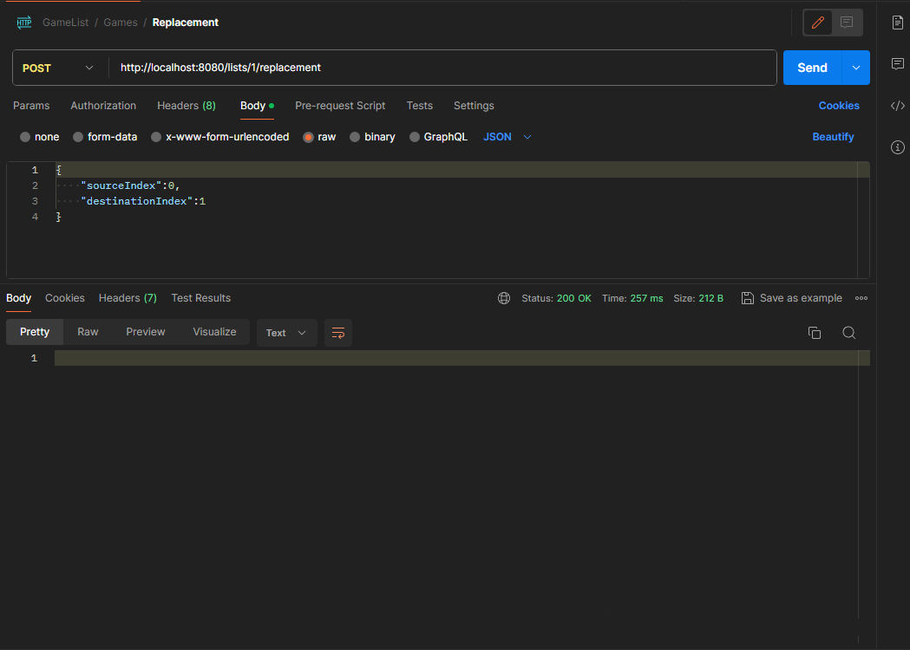
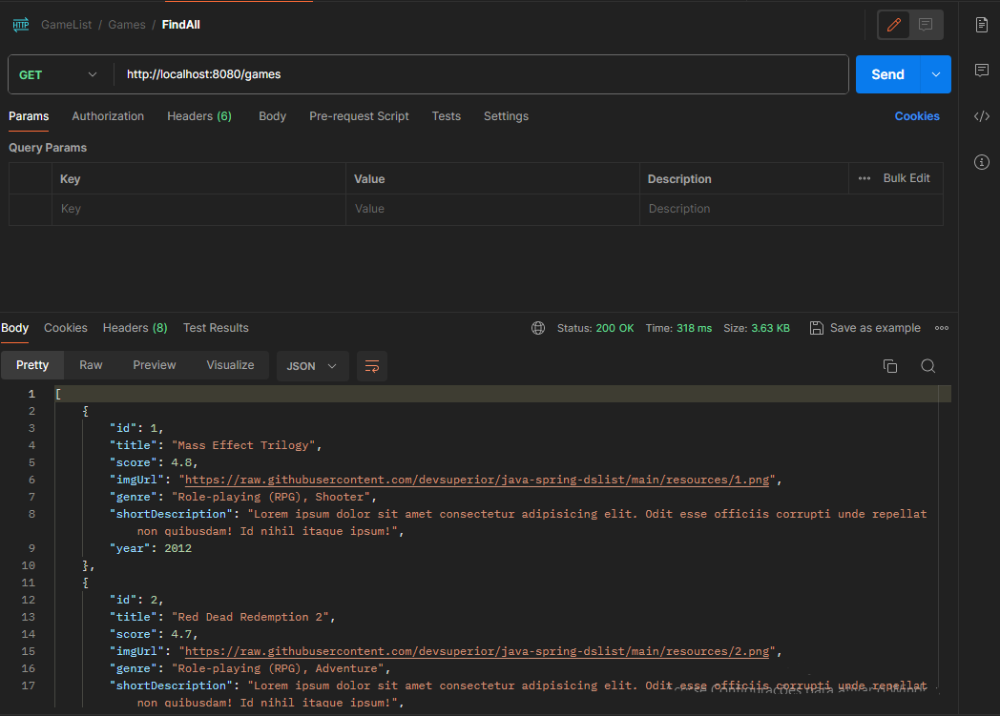

# GameList
[](https://github.com/ualashenr/MoviesRank/blob/master/LICENSE) 

# Sobre o projeto
Exibe uma lista de jogos sendo possível mudar a ordem dos jogos na lista, exibir um jogo específico e navegar entre as listas.

# Vídeo aprensentativo

https://github.com/ualashenr/GameList/assets/119761448/a6f48f89-ac36-4620-bf3a-0d24a96f57ec

# Tecnologias utilizadas

## Back-end
* Java
* Spring
* Maven

## Front-end
* Angular v17
* Bootstrap
* Html, Css e Javascript

# End Points

## Games
* GET `http://localhost:8080/games`: Retorna todos os jogos
* GET `http://localhost:8080/games/1`: Retorna um jogo por ID

## Listas
* GET `http://localhost:8080/lists`: Retorna todas listas
* GET `http://localhost:8080/lists/1`: Retorna uma lista por ID
* GET `http://localhost:8080/lists/1/games`: Retorna todos os jogos de uma lista

## Replacement
* POST `http://localhost:8080/lists/1/replacement`: Troca os jogos de posição na lista

# Postman Exemplo



# Como executar o projeto

## Back-end

Pré-requisitos: Java 17

```bash
# clonar repositório
git clone https://github.com/ualashenr/GameList.git

# entrar na pasta do projeto back end
cd backend

# executar o projeto
./mvnw spring-boot:run
```

## Front-end

Pré-requisitos: Angular 17

```bash
# clonar repositório
git clone https://github.com/ualashenr/GameList.git

# entrar na pasta do projeto back end
cd frontend

# executar o projeto
ng serve
```

# Autor
Ualas Henrique Bezerra Filho

https://www.linkedin.com/in/ualas-henrique-54678827a/
